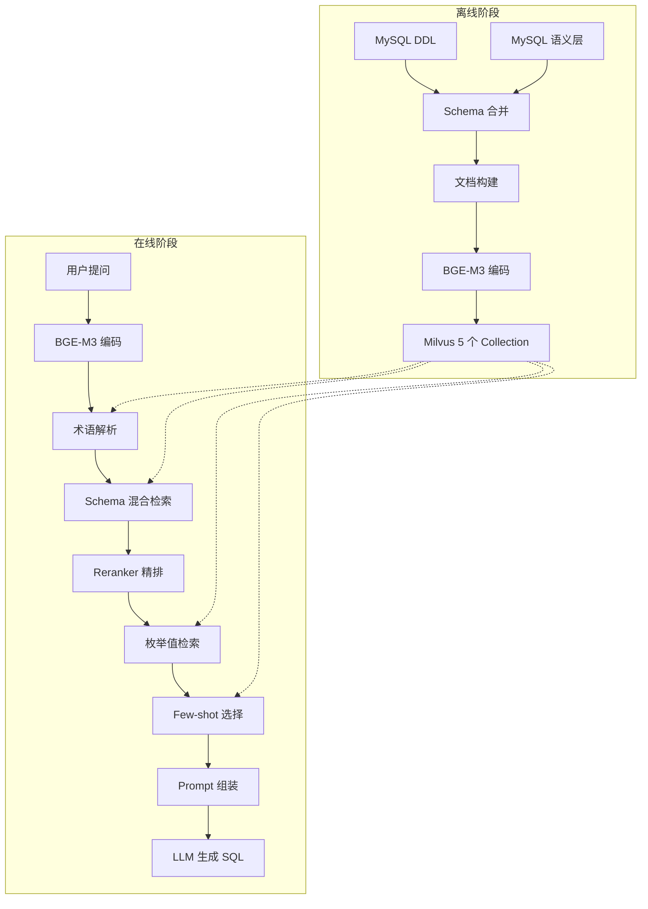
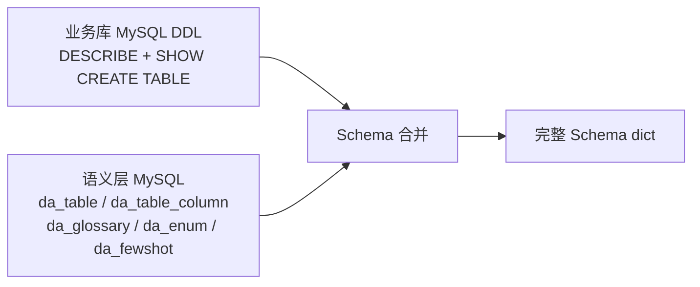
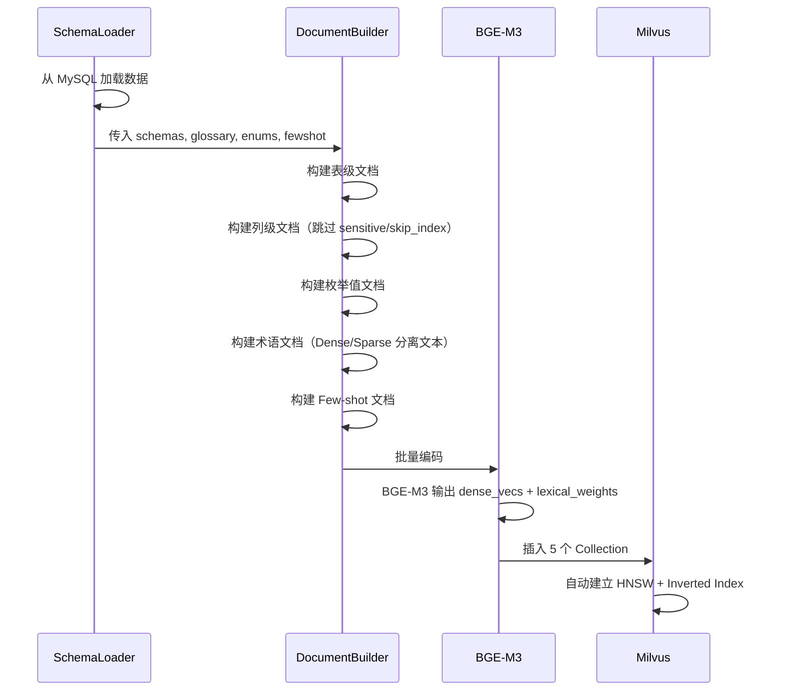
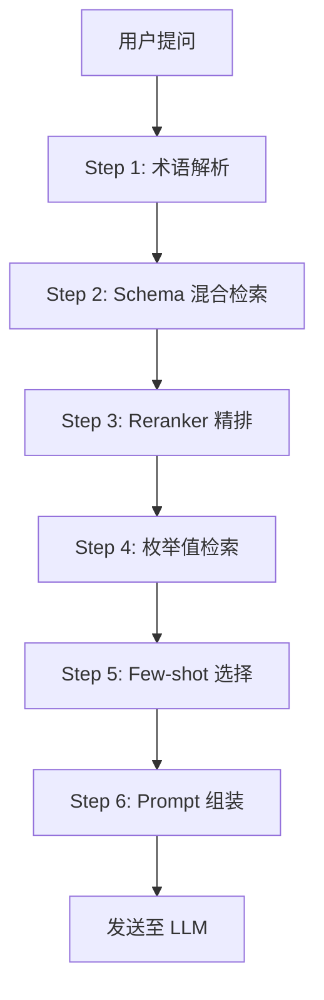
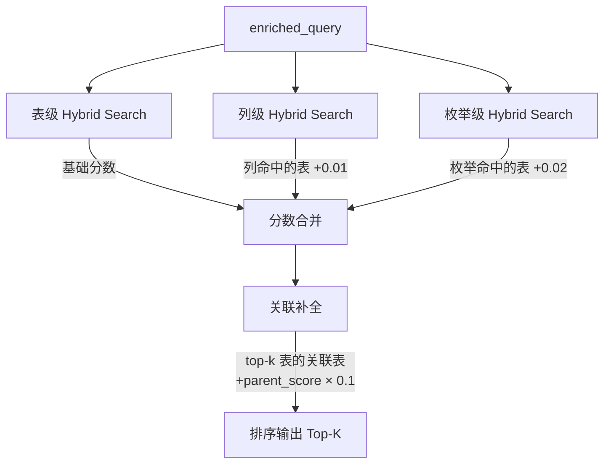
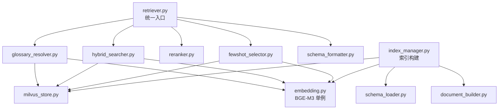

# RAG 检索体系与向量化设计

> 本文档描述 Data Agent NL2SQL 系统的 RAG 检索体系——从语义层数据的离线向量化构建，到用户提问时的在线多级检索流程。
> 对应代码目录：`src/retrieval/`

---

## 1. 设计目标

| 指标 | 目标 |
|------|------|
| 表级召回率（Top-5） | ≥ 90%（用户提到的表一定被召回） |
| 表级精确率（Top-3） | ≥ 80%（前 3 张表中至少包含核心表） |
| 检索延迟 | < 500ms（不含 LLM） |
| Few-shot 命中率 | 相似问题能选到最匹配的示例 |

核心思路：**离线构建多粒度向量索引，在线通过多信号融合找到最相关的表、列、枚举和示例，组装为 LLM 能理解的 Prompt**。

---

## 2. 全局架构

系统分为**离线构建**和**在线检索**两个阶段。



---

## 3. Milvus 向量存储设计

所有向量数据存储在 Milvus 的 `nl2sql` 数据库中，共 5 个 Collection。

### 3.1 Collection 总览

| Collection | 用途 | 向量维度 | 典型数据量 |
|---|---|---|---|
| `nl2sql_table` | 表级检索 | Dense 1024 + Sparse | ~214 张表 |
| `nl2sql_column` | 列级检索 | Dense 1024 + Sparse | ~2600 列 |
| `nl2sql_enum` | 枚举值检索 | Dense 1024 + Sparse | ~800 值 |
| `nl2sql_fewshot` | Few-shot 示例 | Dense 1024 + Sparse | ~700 条 |
| `nl2sql_glossary` | 业务术语 | Dense 1024 + Sparse | ~54 条 |

### 3.2 各 Collection Schema

#### nl2sql_table（表级）

| 字段 | 类型 | 说明 |
|---|---|---|
| id | INT64 (PK) | 自增主键 |
| dense_vec | FLOAT_VECTOR(1024) | Dense 语义向量 |
| sparse_vec | SPARSE_FLOAT_VECTOR | Sparse 稀疏向量 |
| db_name | VARCHAR | 数据库名 |
| table_name | VARCHAR | 表名 |
| table_cn_name | VARCHAR | 中文表名 |
| table_comment | VARCHAR | 表描述 |
| business_domain | VARCHAR | 业务域标签 |
| schema_json | VARCHAR | 完整 Schema JSON |

#### nl2sql_column（列级）

| 字段 | 类型 | 说明 |
|---|---|---|
| id | INT64 (PK) | 自增主键 |
| dense_vec | FLOAT_VECTOR(1024) | Dense 语义向量 |
| sparse_vec | SPARSE_FLOAT_VECTOR | Sparse 稀疏向量 |
| db_name | VARCHAR | 数据库名 |
| table_name | VARCHAR | 所属表名 |
| column_name | VARCHAR | 列名 |
| column_cn_name | VARCHAR | 中文列名 |
| column_type | VARCHAR | 数据类型 |
| column_comment | VARCHAR | 列描述 |
| enum_values | VARCHAR | 枚举值（如有） |
| is_enum | BOOL | 是否为枚举列 |

#### nl2sql_enum（枚举值）

| 字段 | 类型 | 说明 |
|---|---|---|
| id | INT64 (PK) | 自增主键 |
| dense_vec | FLOAT_VECTOR(1024) | Dense 语义向量 |
| sparse_vec | SPARSE_FLOAT_VECTOR | Sparse 稀疏向量 |
| table_name | VARCHAR | 所属表名 |
| column_name | VARCHAR | 所属列名 |
| enum_code | VARCHAR | 枚举码值 |
| enum_label_cn | VARCHAR | 中文标签 |
| description | VARCHAR | 描述 |
| synonyms | VARCHAR | 同义词 |
| sql_value | VARCHAR | SQL 中使用的值 |

#### nl2sql_fewshot（Few-shot 示例）

| 字段 | 类型 | 说明 |
|---|---|---|
| id | INT64 (PK) | 自增主键 |
| dense_vec | FLOAT_VECTOR(1024) | Dense 语义向量 |
| sparse_vec | SPARSE_FLOAT_VECTOR | Sparse 稀疏向量 |
| question | VARCHAR | 问题文本 |
| sql | VARCHAR | 标准 SQL |
| involved_tables | VARCHAR | 涉及的表（JSON 数组） |
| difficulty | VARCHAR | 难度 |

#### nl2sql_glossary（业务术语）

| 字段 | 类型 | 说明 |
|---|---|---|
| id | INT64 (PK) | 自增主键 |
| dense_vec | FLOAT_VECTOR(1024) | Dense 语义向量（"术语: 定义"编码） |
| sparse_vec | SPARSE_FLOAT_VECTOR | Sparse 稀疏向量（"术语 同义词"编码） |
| term | VARCHAR | 术语名称 |
| definition | VARCHAR | 业务定义 |
| sql_hint | VARCHAR | SQL 条件提示 |
| related_tables | VARCHAR | 关联表 |
| related_columns | VARCHAR | 关联列 |
| synonyms | VARCHAR | 同义词 |

### 3.3 索引配置

| 向量类型 | 索引算法 | 相似度度量 |
|---|---|---|
| Dense (FLOAT_VECTOR) | HNSW | COSINE |
| Sparse (SPARSE_FLOAT_VECTOR) | Inverted Index | IP (Inner Product) |

所有标量字段均建立倒排索引以支持混合过滤。

---

## 4. 离线阶段：索引构建

### 4.1 数据加载

数据来自两个源头，合并后得到完整的 Schema 信息。



- **业务库 DDL**：从 MySQL 业务库自动获取列名、类型、COMMENT、主键等物理信息
- **语义层**：人工补充的中文名、描述、标签、枚举值、关联关系、常见问题、业务术语（存储在 MySQL data_agent 库）
- **合并规则**：语义层字段覆盖 DDL 同名字段；DDL 中有但语义层中没有的列保留原始信息

### 4.2 文档构建

将合并后的 Schema dict 转化为纯文本文档，用于向量编码。

#### 表级文档

每张表生成一条文档，包含：表名、中文名、数据库、描述、业务标签、关键列摘要、关联表、查询提示。

> 只挑选有业务含义的关键列，跳过技术字段，避免检索噪音。

#### 列级文档

每列一条文档，包含：所属表名（中文名）、列名、中文名、类型、描述、枚举值。

跳过规则：
- `sensitive = true` 的列（敏感数据不参与检索）
- `skip_index = true` 的列（JSON 配置、技术字段）
- 无 COMMENT 且无语义补充的纯技术列

#### 枚举值文档

每个枚举值一条文档，来自 `da_enum_def` + `da_enum_value` 表。文本拼接中文标签、英文标签、同义词，确保自然语言能命中。

### 4.3 BGE-M3 编码

使用 BGE-M3（BAAI/bge-m3）模型，**一次推理同时产出 Dense 和 Sparse 两种向量**。

| 向量类型 | 维度 | 特点 | 擅长 |
|---|---|---|---|
| Dense | 1024 维浮点 | 语义理解 | "帮我看看销售情况" → 命中"商户账户表" |
| Sparse | 变长稀疏 | 词汇精确匹配 | "pmt_account" → 精确命中表名 |

### 4.4 术语的特殊编码策略

**Glossary 是唯一采用 Dense/Sparse 分离编码的 Collection**。

| 向量 | 编码文本 | 目的 |
|---|---|---|
| Dense | `"{术语}: {定义}"` | 语义理解："活跃商户"能匹配"哪些商户在用" |
| Sparse | `"{术语} {同义词1} {同义词2}..."` | 精确匹配：缩写、专有名词精确命中 |

其他 4 个 Collection 使用统一的 Dense + Sparse 编码（两种向量从同一文本生成）。

### 4.5 构建流程



---

## 5. 在线阶段：检索流程

用户提问后，经过 6 个步骤完成检索和 Prompt 组装。



### 5.1 术语解析（GlossaryResolver）

在正式检索前，先识别用户提问中的业务术语。

**流程**：
1. 用户提问 → BGE-M3 编码
2. 在 `nl2sql_glossary` 中做 Hybrid Search（Dense + Sparse → RRF 融合）
3. 用相对阈值过滤：`min_score = max_score × 0.5`
4. 命中术语的 `related_tables`、`related_columns` 关键词追加到查询中

**输出**：
- `enriched_query`：追加了关联表列关键词的增强查询
- `business_context`：术语定义 + SQL 提示文本（后续注入 Prompt）
- `matched_terms`：命中的术语列表

**示例**：
```
用户提问："LPSP 的 KYC 通过率是多少"
  命中术语：LPSP（account_type=2000）、KYC（verification_status）
  enriched_query 追加：pmt_account, account_type, verification_status
  business_context："LPSP = 持牌支付服务商，account_type = 2000"
```

### 5.2 Schema 混合检索（HybridSearcher）

多粒度检索 + 多信号融合，找到最相关的表。



**四个信号源**：

| 信号 | 检索目标 | 加分方式 | 说明 |
|------|---------|---------|------|
| 表级检索 | nl2sql_table | 基础分数 | 宽泛提问的主力命中 |
| 列级检索 | nl2sql_column | 命中列的所属表 +0.01 | 指标/字段精确提问的补充 |
| 枚举反哺 | nl2sql_enum | 命中枚举的关联表 +0.02 | 枚举值提问的补充 |
| 关联补全 | da_table_relation | 关联表 += parent_score × 0.1 | 确保 JOIN 相关表被召回 |

每个信号内部均采用 **Dense + Sparse → RRF 融合** 排序。

**RRF 融合公式**：

```
RRF_score(d) = Σ 1 / (k + rank_i(d))
```

其中 k = 60（RRF_K 参数），rank_i(d) 为文档 d 在第 i 个排序中的排名。

### 5.3 Reranker 精排（SchemaReranker，可选）

启用时（ENABLE_RERANKER=true），对混合检索的 Top-N 候选做交叉编码器二次精排。

**流程**：
1. 取混合检索的前 RERANK_INPUT_TOP_K（默认 10）个候选
2. BGE-Reranker-v2-M3 对 (query, doc_text) 做交叉注意力打分
3. 按 rerank 分数重新排序，取 Top-K（默认 5）

**Reranker 后关联补回**：Reranker 淘汰的候选中，如果与 Top-K 表有关联关系，仍会被补回。避免因精排而丢失必要的 JOIN 表。

### 5.4 枚举值检索

在 `nl2sql_enum` 中检索用户提问涉及的枚举值映射。

**输出格式**（注入 Prompt）：
```
"LPSP" → pmt_account.account_type = 2000
"已通过" → pmt_account.verification_status = 1
```

帮助 LLM 将自然语言映射为正确的 WHERE 条件值。

### 5.5 Few-shot 示例选择（FewShotSelector）

从 `nl2sql_fewshot` 中选择最匹配的示例。

**三步策略**：

1. **Dense 语义检索**：问题相似度召回 Top-10 候选
2. **表重叠加权**：每条候选与当前命中表的重叠数 × 0.1 加分
3. **MMR 多样性选择**：从 Top-10 中选 FEWSHOT_TOP_K（默认 3）条

**MMR 公式**：

```
MMR_score = λ × relevance - (1-λ) × max_sim_to_selected
```

λ = 0.7（偏向相关性），保证选出的示例覆盖不同 SQL 模式（聚合、JOIN、子查询、时间范围等），避免同质化。

### 5.6 Prompt 组装（SchemaFormatter）

将所有检索结果组装为 LLM 最终看到的 Prompt。

**Prompt 结构**：

```
## 可用数据表
<DDL 格式的表 Schema，含列注释、枚举内联、JOIN 提示、查询注意事项>

## 枚举值映射
<自然语言 → SQL 值的映射列表>

## 业务上下文
<术语定义 + SQL 提示>

## 参考示例
<Few-shot 问答对>
```

**Schema 使用 CREATE TABLE DDL 格式**，因为 LLM 训练数据中大量出现该格式，理解最准确。枚举值以 `[value=label]` 内联在列注释中。

---

## 6. 关键设计决策

### 6.1 为什么用 Milvus 而不是 FAISS + 自建倒排

- Milvus 原生支持 Dense + Sparse Hybrid Search 和 RRF 融合，无需自行实现
- 内置持久化，无需手工管理 FAISS 索引文件和 JSON 倒排文件
- 标量字段倒排索引支持混合过滤，扩展性更好

### 6.2 为什么用 BGE-M3 Learned Sparse 而不是 BM25

- 一次 encode 同时产出 Dense 和 Sparse，无需两个独立系统
- Learned Sparse 理解同义词（"利润" ≈ "profit"），BM25 只做字面匹配
- 不依赖外部中文分词（jieba），减少依赖和故障点

### 6.3 为什么需要双粒度索引（表级 + 列级）

- 表级：解决 "查订单数据" 这类宽泛提问
- 列级：解决 "退货率" "利润率" 这类指标精确提问，命中列后反推表
- 单一粒度无法同时覆盖两类场景

### 6.4 为什么术语要 Dense/Sparse 分离编码

- Dense 用 "术语: 定义" → 语义匹配（"活跃商户" 能命中"哪些商户还在用"）
- Sparse 用 "术语 同义词" → 精确匹配（"LPSP"、"KYC" 这类缩写靠 Sparse 精确命中）
- 合并编码会导致定义文本稀释缩写词的 Sparse 权重

### 6.5 为什么 Few-shot 需要 MMR 多样性

- 纯相似度 Top-3 容易选出同质化示例（都是简单聚合查询）
- MMR 保证覆盖不同 SQL 模式（聚合/JOIN/子查询/时间范围）
- 实际效果比纯 Top-K 更稳定

### 6.6 Reranker 后为什么要关联补回

- 交叉编码器只看 (query, doc) 相关性，不理解表间关联
- JOIN 表可能因为与 query 直接相关性低被淘汰，但 SQL 生成时必需
- 补回机制：检查 Reranker 淘汰的候选是否与 Top-K 表有 relation，有则恢复

---

## 7. 模块结构

```
src/retrieval/
├── retriever.py            # 对外统一入口（SchemaRetriever）
├── schema_loader.py        # 数据加载（MySQL DDL + 语义层合并）
├── document_builder.py     # Schema → 检索文档（文本化）
├── embedding.py            # BGE-M3 封装（单例，Dense + Sparse 一次编码）
├── milvus_store.py         # Milvus 客户端封装（Collection 管理、Hybrid Search）
├── index_manager.py        # 索引构建管理（5 个 Collection 的 Schema 定义 + 构建流程）
├── glossary_resolver.py    # 业务术语解析
├── hybrid_searcher.py      # 多粒度混合检索（表 + 列 + 枚举反哺 + 关联补全）
├── reranker.py             # Reranker 精排（BGE-Reranker-v2-M3）
├── fewshot_selector.py     # Few-shot 选择（Dense + 表重叠 + MMR）
├── schema_formatter.py     # Prompt 格式化（DDL + 枚举 + 上下文 + 示例）
├── agent_config.py         # Agent 运行时配置加载
└── config.py               # 全局配置（环境变量 + .env）
```

### 模块调用关系



---

## 8. 配置参考

### 检索参数

| 参数 | 默认值 | 说明 |
|------|--------|------|
| TABLE_SEARCH_TOP_K | 5 | 最终返回的表数量 |
| COLUMN_SEARCH_TOP_K | 20 | 列级检索返回数量 |
| RECALL_TOP_K | 20 | 混合检索召回数量 |
| RERANK_INPUT_TOP_K | 10 | 送入 Reranker 的候选数量 |
| FEWSHOT_TOP_K | 3 | Few-shot 示例数量 |
| RRF_K | 60 | RRF 融合参数 |
| MMR_LAMBDA | 0.7 | MMR 相关性权重（0=多样性，1=相关性） |
| GLOSSARY_SCORE_THRESHOLD | 0.5 | 术语匹配相对阈值（× 最高分） |
| ENABLE_RERANKER | true | 是否启用 Reranker 精排 |

### 基础设施

| 组件 | 配置 |
|------|------|
| Milvus | localhost:19530，数据库 nl2sql |
| BGE-M3 | BAAI/bge-m3，1024 维 Dense |
| Reranker | BAAI/bge-reranker-v2-m3 |
| MySQL | localhost:3306，数据库 data_agent |
| MySQL（业务库） | 通过 MYSQL_HOST/PORT/USER/PASSWORD 配置 |

---

## 9. 技术选型总结

| 组件 | 选型 | 理由 |
|------|------|------|
| Embedding | BGE-M3 | 中文最佳；Dense + Sparse 一次推理 |
| 向量存储 | Milvus | 原生 Hybrid Search + RRF；持久化；标量过滤 |
| Reranker | BGE-Reranker-v2-M3 | 与 BGE-M3 配套；中文效果好 |
| 融合算法 | RRF (k=60) | 无需调参；天然适配不同量纲分数 |
| Few-shot | MMR (λ=0.7) | 平衡相关性和多样性 |
| Schema 格式 | CREATE TABLE DDL + 注释 | LLM 最熟悉的格式；准确率最高 |
